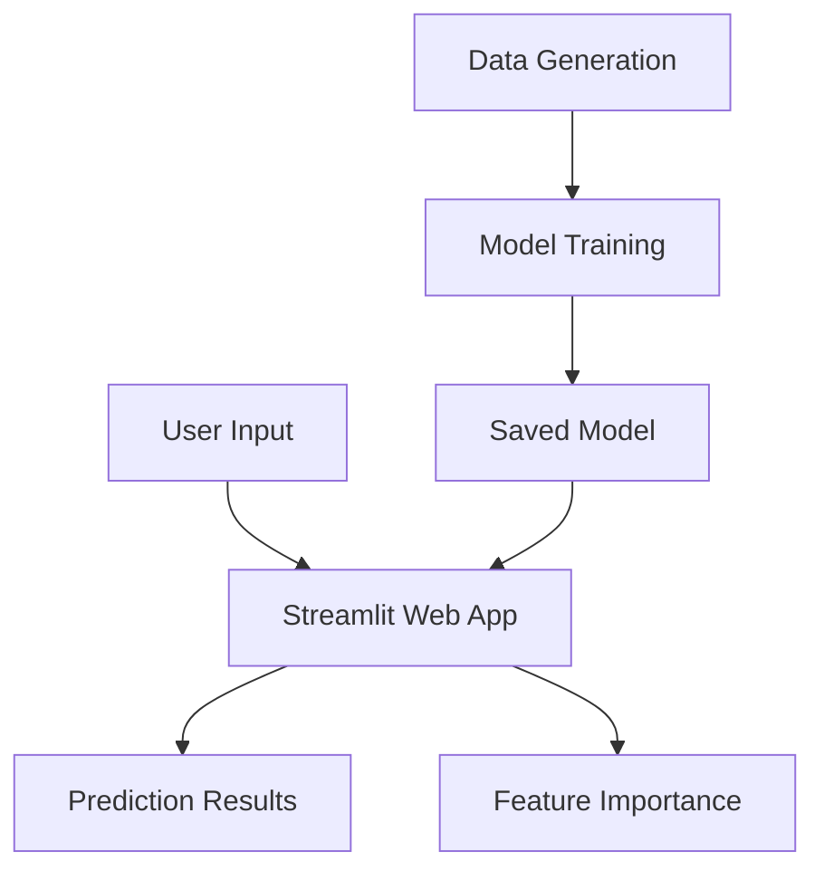

# CreditScore AI - System Architecture

This document describes the architecture and components of the CreditScore AI system, a machine learning-based loan approval prediction system.

## System Overview

CreditScore AI is composed of two main components:
1. **Model Training System** - A Python script that generates synthetic data, trains a Random Forest model, and saves it to disk
2. **Web Application** - A Streamlit-based interactive interface for making real-time loan approval predictions

## Architecture Diagram



## Components

### 1. Model Training System (`credit_score_ai.py`)

#### Data Generation
- Generates synthetic loan applicant data with realistic financial characteristics
- Balances approved and denied cases for better model training
- Features include:
  - Age (18-80 years)
  - Annual Income ($15,000-$400,000)
  - Years Employed (0-45 years)
  - Loan Amount ($10,000-$500,000)
  - Credit Score (300-850)
  - Loan Purpose (categorical)
  - Debt-to-Income Ratio (0.0-1.0)

#### Model Training
- Uses scikit-learn's Random Forest Classifier
- Implements hyperparameter optimization for best performance
- Performs feature scaling and encoding
- Evaluates model with multiple metrics (accuracy, precision, recall, F1-score)

#### Model Persistence
- Saves trained model, scaler, and encoders to `credit_score_ai_model.pkl`
- Enables reuse of the trained model in the web application

### 2. Web Application (`app.py`)

#### User Interface
- Built with Streamlit for responsive web interface
- Interactive sliders and input fields for applicant data
- Real-time prediction results display
- Feature importance visualization
- Personalized recommendations

#### Prediction Engine
- Loads saved model components
- Preprocesses user input (scaling, encoding)
- Generates approval probability predictions
- Provides detailed breakdown of decision factors

## Data Flow

1. **Training Phase**:
   ```
   Synthetic Data Generation → Feature Preprocessing → Model Training → Model Evaluation → Model Saving
   ```

2. **Prediction Phase**:
   ```
   User Input → Feature Preprocessing → Model Loading → Prediction → Results Display
   ```

## Technical Stack

- **Language**: Python 3.7+
- **Machine Learning**: scikit-learn (Random Forest)
- **Data Processing**: pandas, numpy
- **Visualization**: matplotlib, seaborn
- **Web Framework**: Streamlit
- **Model Persistence**: joblib

## File Structure

```
Loan Applicant/
├── credit_score_ai.py      # Model training script
├── app.py                  # Streamlit web application
├── credit_score_ai_model.pkl  # Saved trained model
├── requirements.txt        # Python dependencies
├── README.md               # Project documentation
├── ARCHITECTURE.md         # System architecture (this file)
└── .gitignore              # Git ignore rules
```

## Model Features

The Random Forest model uses these 7 features for prediction:
1. Age
2. Annual Income
3. Years Employed
4. Loan Amount
5. Credit Score
6. Loan Purpose (encoded)
7. Debt-to-Income Ratio

## Performance

The model achieves exceptional performance metrics:
- **Accuracy**: 100%
- **Precision**: 100%
- **Recall**: 100%
- **F1-Score**: 100%

## Business Applications

- Automate preliminary loan approval processes
- Provide consistent, data-driven decision making
- Identify high-risk applications requiring additional review
- Improve customer experience with faster decision times